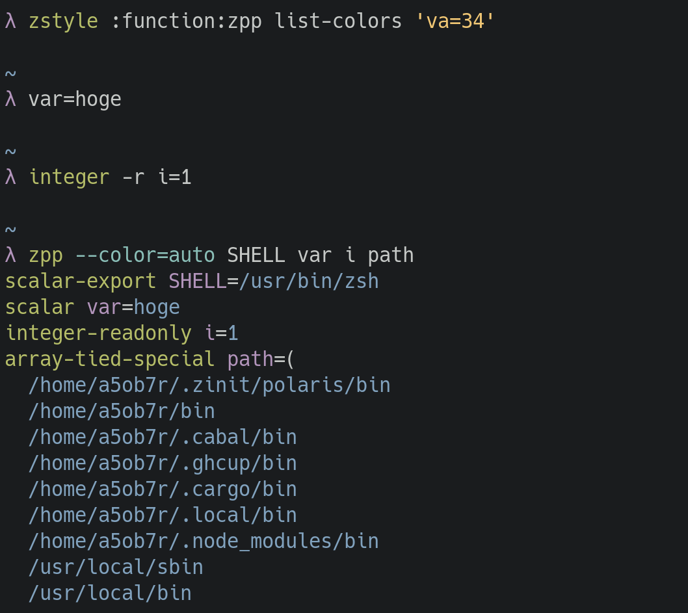

# Pretty printer for Zsh variables



## Overview

```zsh
$ zpp --help
Descriptions:
  Pretty printer function for shell variables.

  This can get print config for print through zstyle like list-colors for
  ':completion:*' context. Each parameter's form is '<key>=<value>'. <value> is
  used to print variables and should be escape sequence parameter.

  zstyle ':function:zpp' list-colors \
    'sc=31' \
    'va=36' \
    ... \
    ;

  Avairable parameter keys
  - lc: Left
  - rc: Right
  - rs: Reset
  - sc: Scalar type variable attributes
  - in: Integer type variable attributes
  - fl: Float type variable attributes
  - ar: Array type variable attributes
  - as: Associative array type variable attributes
  - na: Variable name
  - va: Variable value
  - ke: Associative array's key

Usage:
  zpp [options]... <variable_name>...

Options:
  --color[=WHEN]  Print variable with color. Valid values for WHEN are
                  'always', 'auto' or 'never'. 'always' is used if WHEN is
                  omitted
  -h, --help      Show this message and return.
  --version       Show version info and return.

```

## Usage

```zsh
$ zpp SHELL EDITOR path
```
